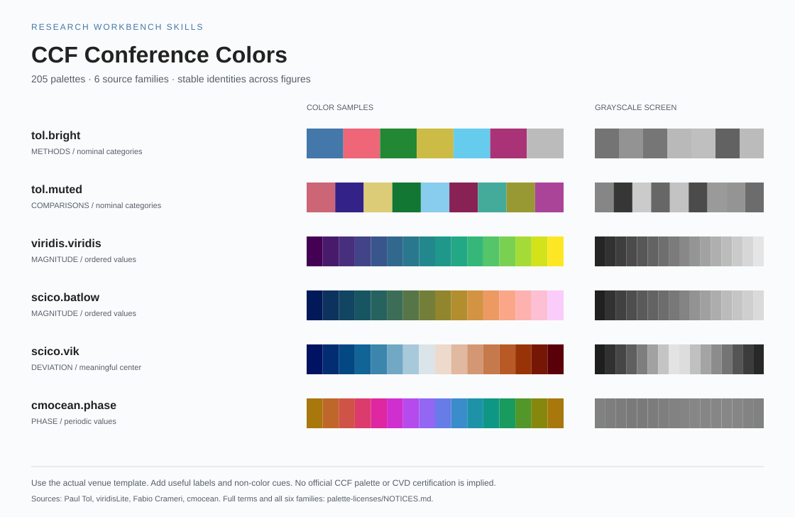

# Research Workbench Skills

**47 个可独立使用的科研技能，覆盖研究构思、模型训练、Agent、视觉与动作策略、论文写作和科研图表。**

[English](README.md) · [完整技能目录](docs/catalog.zh-CN.md) · [贡献指南](CONTRIBUTING.md) · [版本记录](CHANGELOG.md)

本项目独立改编了 [Orchestra Research](https://github.com/Orchestra-Research/AI-Research-SKILLs) 的45个技能，以及从 [easyplot](https://github.com/Rimagination/easyplot) 提取的1个科研配色技能，并新增原创 [SWABLAB Log](skills/swablab-log/SKILL.md) 训练 run 记录技能。每个 `skills/<name>/` 都有完整的本地说明和所需资源，采用 [Agent Skills 格式](https://agentskills.io/specification)及 [OpenAI 技能使用方式](https://learn.chatgpt.com/docs/build-skills)。

## 选择和使用

[目录](docs/catalog.zh-CN.md)按16个类别列出47个技能。安装时，将 `skills/` 下选中的完整技能文件夹复制到宿主支持的位置，可以手动复制，也可以用选择工具。当前 Codex 文档列出的个人目录是 `~/.agents/skills`，项目目录是 `.agents/skills`。依据见 [OpenAI 本地技能说明](https://learn.chatgpt.com/docs/build-skills)。

选择工具需要 Python 3.9+，无需安装第三方库：

```sh
python3 scripts/install.py --list-categories
python3 scripts/install.py --skill creative-thinking-for-research --dry-run
python3 scripts/install.py --skill creative-thinking-for-research
python3 scripts/install.py --category 08 --dest ./selected-skills
python3 scripts/install.py --category 20 --skill brainstorming-research-ideas --dest ./selected-skills
python3 scripts/install.py --all --dest ./selected-skills
```

默认复制到 `~/.agents/skills`；用 `--dest` 指定项目、普通检查目录或其他宿主认可的位置，包括旧版路径。通过技能名、类别或 `--all` 指定范围，重叠的选择会自动去重。工具复制所选文件夹及其本地资源和许可，遇到已有同名目录时停止。根目录文档、测试和行为评估材料保留在仓库中。

在 Codex 中可以使用 `$skill-name` 显式调用，也可由宿主根据描述匹配：

```text
使用 $brainstorming-research-ideas 比较我的科研问题有哪些可行方向。
使用 $torchtitan 检查现有预训练配置与检查点方案。
使用 $swablab-log 记录这个训练，或更新已有 run 的日志和指标。
使用 $ccf-conference-colors 为论文中的方法建立跨图一致的配色。
```

围绕任务和现有项目选择技能，沿用已经确定的框架与产物。[技能目录](docs/catalog.zh-CN.md)说明各技能的替代关系和组合方式。技能提供独立于模型的任务指令，辅助模型型号、推理设置、工具和权限由宿主管理；训练框架、模型权重、数据集和硬件由科研项目提供。更新辅助模型时，保留科学实验锁定的软件环境。

## 科研配色



[CCF Conference Colors](skills/ccf-conference-colors/SKILL.md)提供6个来源家族的205套色板、精确HEX取色、标签到颜色的固定映射、对比度与灰度诊断。核心工具只需要Python标准库，Matplotlib接口按需使用。在本地浏览器打开[色板图库](skills/ccf-conference-colors/assets/palette-gallery.html)即可浏览。完成图形后，按目标会议模板和最终尺寸检查。详见[配色适配与许可说明](docs/color-adaptation.zh-CN.md)。

## 文件组织

| 目录 | 作用 |
|---|---|
| `skills/` | 独立技能入口和相应参考资料、工具、素材、许可 |
| `evals/` | 可选的模型行为验收题与检查标准 |
| `scripts/` | 技能选择复制、结构校验和用例格式校验 |
| `tests/` | 工具行为、格式检查与独立分发的程序测试 |
| `docs/` | 技能目录、固定来源记录和配色适配说明 |
| `.github/` | 持续集成配置 |

通用格式要求 `SKILL.md`；参考资料、脚本、素材和 OpenAI 界面元数据按需配置。本仓库为每个技能保留界面元数据、许可和来源，便于独立分发。格式要求、仓库约定、验证和发布步骤统一放在[贡献指南](CONTRIBUTING.md)中。

## 开发验证与行为评估

```sh
python -m pip install -r requirements-dev.txt
python scripts/validate.py
python scripts/validate_evals.py
python -m unittest discover -s tests -v
```

PyYAML用于仓库开发校验。89条[行为评估用例](evals/README.md)为维护者提供可选的任务提示和验收标准。格式校验检查用例结构；模型评估通过实际任务运行完成，并单独记录输出。版本检查结果见[更新记录](CHANGELOG.md)，模型评估状态见[评估说明](evals/README.md#evaluation-status)。

## 贡献、帮助与发布

通过仓库Issue提交可复现问题或具体改进，说明技能名、宿主/模型、相关版本、预期结果和实际表现。协作方式与私密报告途径见[贡献指南](CONTRIBUTING.md)。

按贡献指南中的[发布步骤](CONTRIBUTING.md#release)提交源文件夹。需要以插件形式分发时，可继续参考其中链接的打包要求。

## 许可与来源

指令和仓库工具采用[MIT许可](LICENSE)，保留原作者版权。**色板数据分别遵循其来源许可。**分发时保留所选技能内的声明与数据条款，详见[NOTICE](NOTICE.md)、[固定来源记录](docs/sources.json)和[色板许可](skills/ccf-conference-colors/assets/palette-licenses/NOTICES.md)。
